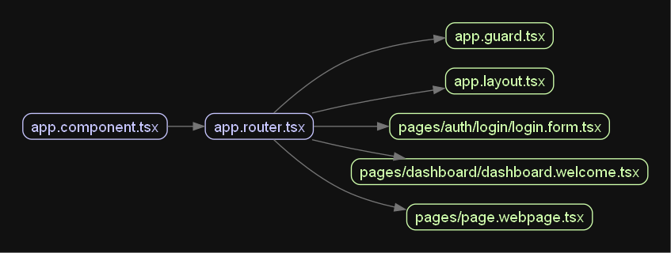

# Update App Graph With WebPage

Now that we move all nested route to app.router.tsx:

```plaintext
app.component.tsx
|-- app.router.tsx
|   |-- app.guard.tsx
|   |-- app.layout.tsx

|   |-- pages/dashboard/dashboard.welcome.tsx

|   |-- pages/auth/login/login.form.tsx

|   |-- pages/page.webpage.tsx
```


