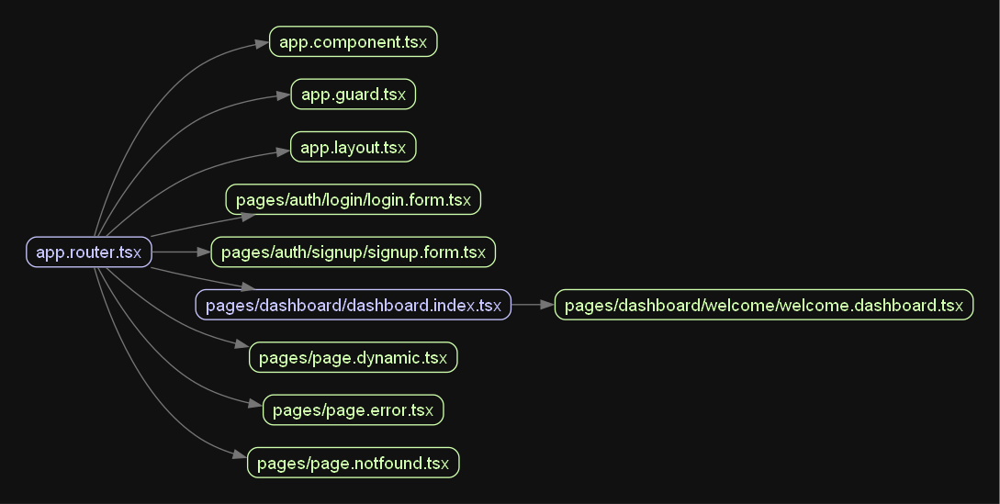

# Update App Graph

Now app.router.tsx wrapping the entire application.

```plaintext
app.router.tsx
|-- app.component.tsx
|-- app.guard.tsx
|-- app.layout.tsx

|-- pages/dashboard/dashboard.index.tsx
|   |-- pages/dashboard/dashboard.welcome.tsx
|-- pages/auth/login/login.form.tsx
|-- pages/auth/signup/signup.form.tsx

|-- pages/page.error.tsx
|-- pages/page.notfound.tsx
|-- pages/page.webpage.tsx
```


