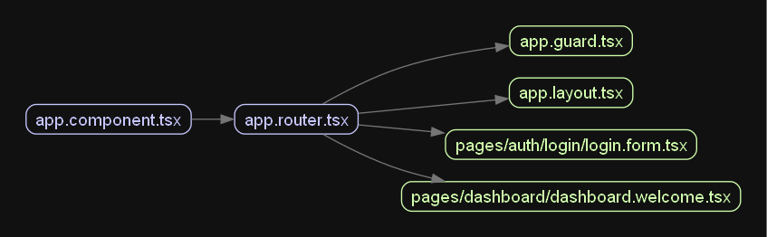

# Add Guard To App Graph

Now that we have wrapped the pages in the suspense layout, the updated project graph looks like this:

```plaintext
app.component.tsx
|-- app.router.tsx
|   |-- app.guard.tsx
|   |-- app.layout.tsx
|   |   |-- pages/auth/login/login.form.tsx
|   |   |-- pages/dashboard/dashboard.welcome.tsx
```


