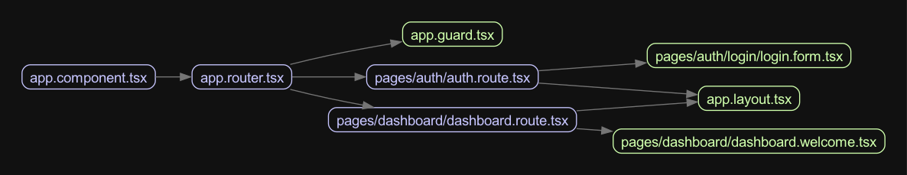

# Update App Graph With Nested Route

Now that we have splitting router that load nested route:

```plaintext
app.component.tsx
|-- app.router.tsx
|   |-- app.guard.tsx
|   |-- pages/auth/auth.route.tsx
|   |   |-- app.layout.tsx
|   |   |-- pages/auth/login/login.form.tsx
|   |-- pages/dashboard/dashboard.route.tsx
|   |   |-- app.layout.tsx
|   |   |-- pages/dashboard/dashboard.welcome.tsx
```


